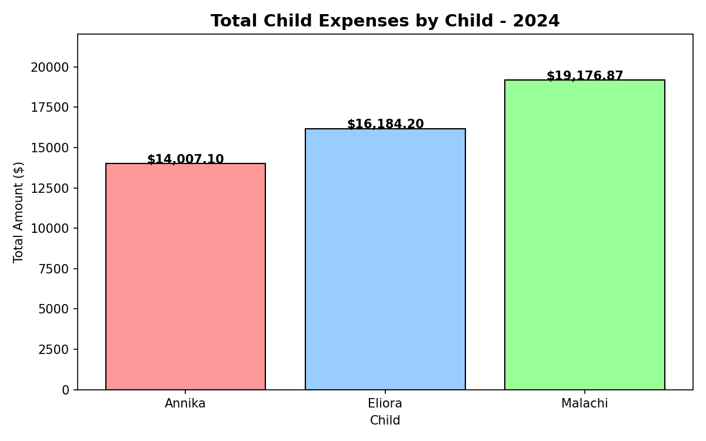
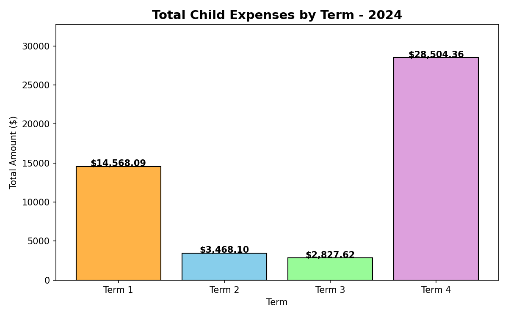
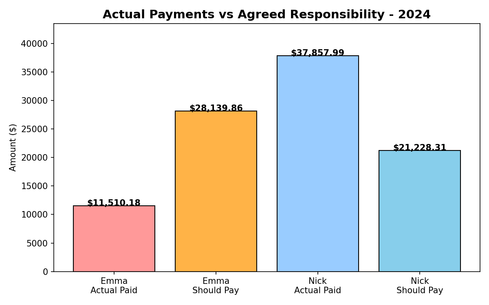
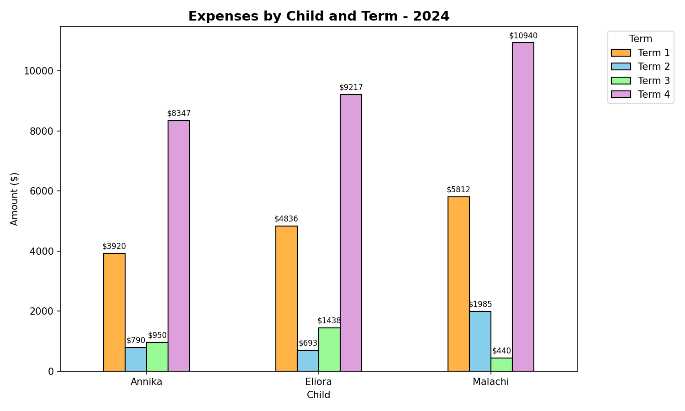

# Child Expense Analysis - 2024

## Overview
Analysis of shared child expenses across a full calendar year, 
tracking actual payments against agreed financial responsibility splits.

**Total expenses analysed: $49,368.17 across 111 transactions**

## Key Findings
- Malachi had the highest expenses at $19,176.87, driven largely by 
  karate and music activities
- Term 2 and Term 3 were the highest spending periods
- Significant variance identified between actual payments and agreed 
  responsibility splits — one party overpaid by $16,629.68

## Analysis Includes
- Total spend per child across all four school terms
- Term-by-term spending trends
- Actual payments vs agreed financial responsibility (57/43 split)
- Combined breakdown by child and term

## Charts

## Tools Used
- Python 3.13
- pandas — data extraction and analysis
- matplotlib — visualisation
- openpyxl — Excel file reading

## Skills Demonstrated
- Real-world messy data extraction from Excel
- Data cleaning and restructuring with pandas
- Financial variance analysis
- Data visualisation with matplotlib